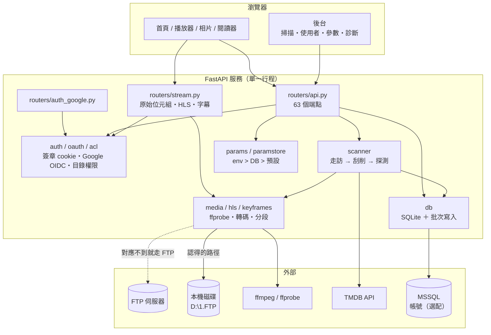
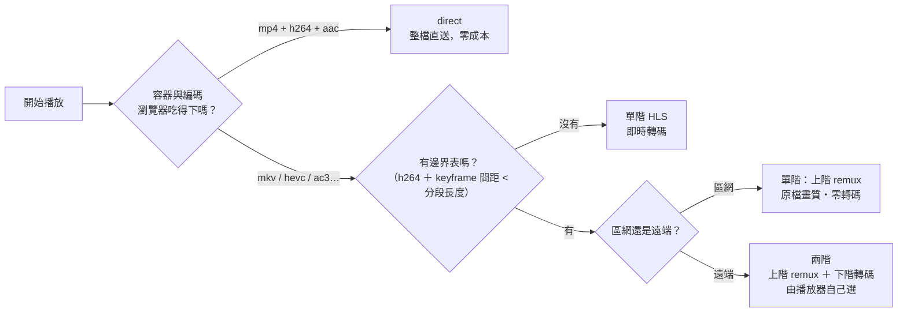
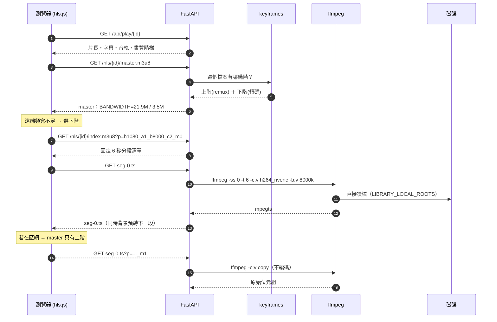
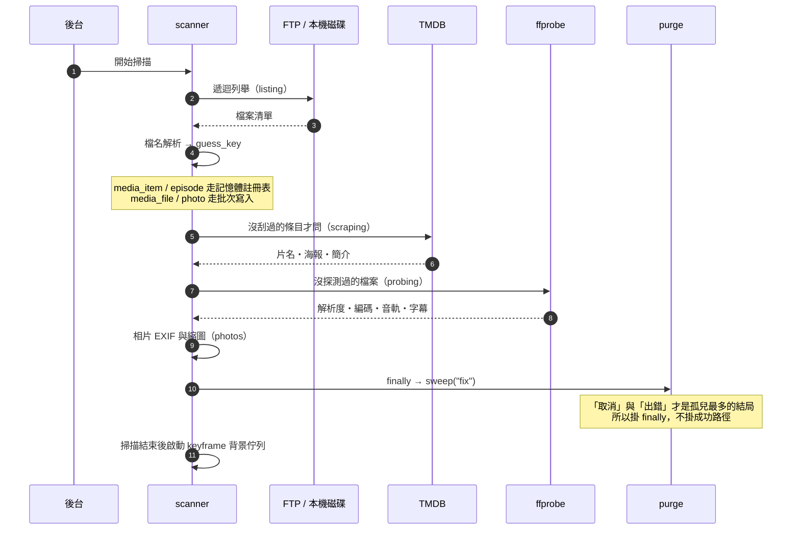
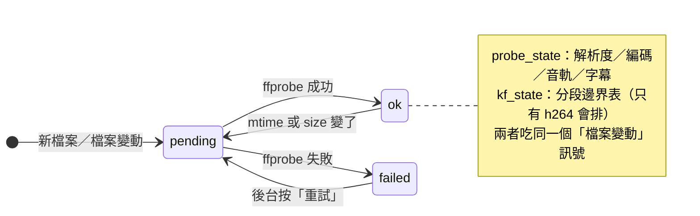
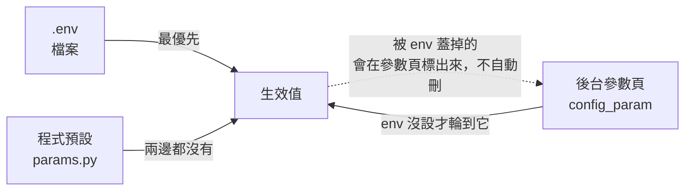
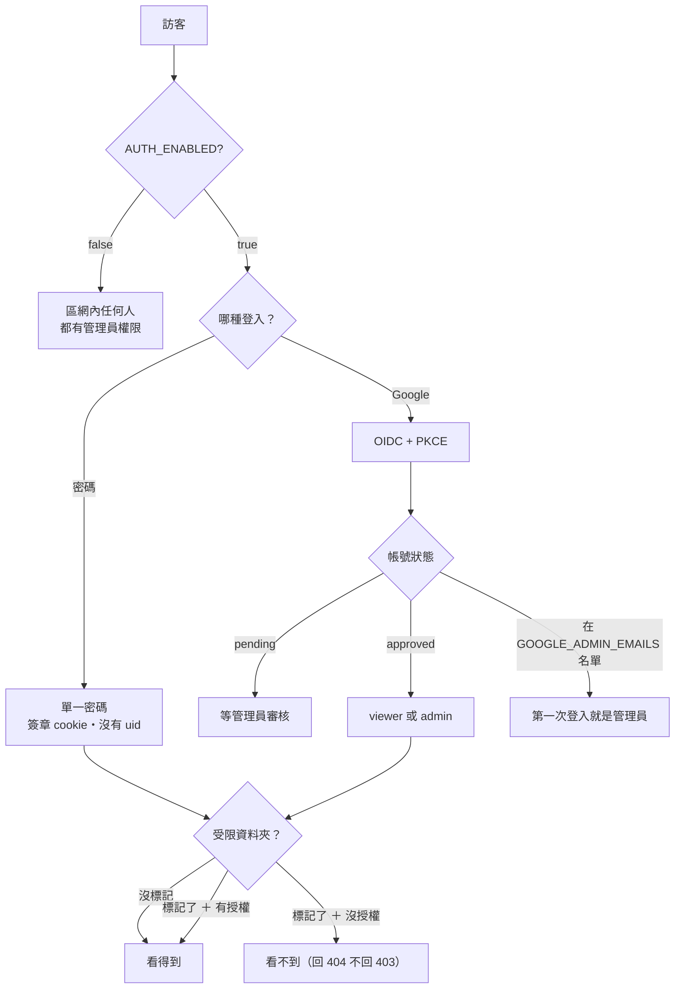

# FilmaxWeb

把一顆放滿影片、相片與 PDF 的硬碟，變成一個**在瀏覽器裡就能看**的媒體庫 ——
自動刮削片名與海報、遠端連線自動降畫質、字幕即時轉檔，全部跑在自己的機器上。

> 這份 README 是**怎麼用、怎麼修**。
> 「**為什麼這樣設計**」在 [`docs/規格需求書.md`](docs/規格需求書.md)（索引）與 `docs/規格/` 底下一章一檔 ——
> 那裡才有量測數據、取捨過程與被推翻過的決定。

---

## 目錄

- [這個東西能做什麼](#這個東西能做什麼)
- [五分鐘跑起來](#五分鐘跑起來)
- [系統架構](#系統架構)
- [播放是怎麼決定的](#播放是怎麼決定的)
- [掃描流程](#掃描流程)
- [資料庫](#資料庫)
- [設定](#設定)
- [登入與權限](#登入與權限)
- [目錄結構](#目錄結構)
- [測試](#測試)
- [疑難排解](#疑難排解)
- [規格書導覽](#規格書導覽)

---

## 這個東西能做什麼

| | |
|---|---|
| **影片** | 自動辨識片名／年份／季集 → 抓 TMDB 的海報與簡介 → 瀏覽器直接播。吃不下的格式即時轉碼，吃得下的直接送原檔 |
| **字幕** | 內嵌字幕即時轉成 WebVTT；繁簡自動判斷；開播時背景預抽整份，跳到中間也不必等 |
| **相片** | EXIF 側欄、1920px 預覽衍生圖、PhotoSwipe 燈箱。**刻意不讀 GPS** |
| **PDF** | 內建閱讀器（PDF.js legacy build），支援大檔的分段讀取 |
| **帳號** | 單一密碼，或 Google 登入 ＋ 管理員審核；可以把某些資料夾標成「只給指定帳號看」 |
| **後台** | 掃描控制、失敗清單、使用者審核、**49 項參數線上改**、診斷頁 |

現況規模（開發機）：**147 個影片檔、1490 張相片、48 個條目**，單機 SQLite。

---

## 五分鐘跑起來

需要 **Python 3.10+** 與 **ffmpeg**（Windows 建議 [BtbN 的 n8.1 build](https://github.com/BtbN/FFmpeg-Builds/releases)）。

```
1. 安裝.bat        建立 .venv、裝套件、裝 playwright（測試用）
2. 編輯 .env       至少要填 FTP 連線資訊與 TMDB_API_KEY
3. 啟動.bat        起服務並自動開瀏覽器 → http://127.0.0.1:8080
4. 後台 → 媒體庫 → 開始掃描
```

`.env` 沒有的話，`啟動.bat` 會從 `.env.example` 複製一份再請你去填 —— 那個檔案裡每一項都有註解說明。

**最少要填的四項：**

```ini
FTP_HOST=127.0.0.1
FTP_USER=你的帳號
FTP_PASS=你的密碼
TMDB_API_KEY=去 themoviedb.org 免費申請
```

**片庫跟服務在同一台機器的話**，加這一行會讓轉碼少繞三層（見 [J 章第 −1 層](docs/規格/J-影片畫質.md)）：

```ini
LIBRARY_LOCAL_ROOTS=/=D:\1.FTP     # FTP 的根目錄「/」實際上是這個資料夾
```

---

## 系統架構



**幾個刻意的設計：**

- **單一行程、單一寫入者。** SQLite 用 WAL，寫入集中在 `db.py`，不必處理死鎖重試。
- **沒有外鍵。** 刪除只有一個進入點 `purge(reason=...)`，連磁碟上的海報縮圖都在裡面一起刪；孤兒數量露在後台總覽當體溫計。
- **設定有優先序**：`.env` > 後台資料庫 > 程式預設。被 `.env` 蓋掉的後台設定會在參數頁標出來，**不會自動刪**。
- **ffmpeg 讀檔優先走本機路徑**，對應不到才回到「HTTP → FastAPI → FTP → 磁碟」那條路。

---

## 播放是怎麼決定的

一個檔案可能走三條路。決定權在**片源本身**與**你在區網還是遠端**：



**上階（remux）** 是 `-c:v copy` —— 視訊位元組原封不動照抄，只換容器、必要時轉音訊。
畫質等於原檔，CPU 幾乎不動。代價是**碼率就是原檔的碼率**（實測某部 19.9 Mbps），所以遠端多半選不到它。

**下階（轉碼）** 綁碼率（`REMOTE_BITRATE_KBPS`，預設 8000），NVENC 硬體編碼，
畫質由 VMAF 量測定案（見 J 章）。

一次遠端播放的完整往返：



**上階的分段邊界不是算出來的，是掃出來的** —— `-c:v copy` 只能從 keyframe 起頭，
所以每個檔案的 keyframe 時間與位元組偏移會先掃一次存進 `media_keyframe`
（每檔約 30 秒，走背景佇列，**不在掃描的關鍵路徑上**）。

---

## 掃描流程



每個檔案都有兩個狀態機，掃描與播放各看各的：



---

## 資料庫

單檔 SQLite（`data/library.db`，WAL 模式）。帳號可以另外放 MSSQL。

| 表 | 放什麼 |
|---|---|
| `media_item` / `episode` | 條目（電影或影集）與集數 |
| `media_file` | 檔案本體 ＋ ffprobe 結果 ＋ 兩個狀態機 |
| `media_keyframe` | keyframe 的**原始**時間與位元組偏移（不存算好的邊界） |
| `play_state` | 續播位置 |
| `photo` / `document` | 相片與 PDF |
| `app_user` / `login_audit` | 帳號與登入稽核 |
| `folder_rule` / `folder_grant` | 受限資料夾與授權 |
| `config_param` / `config_audit` | 後台改過的參數與變更紀錄 |
| `purge_log` | 每一次刪除的理由與筆數 |
| `kv` | 雜項（遷移記號、使用者偏好…） |

**四個會被誤解的設計：**

1. **時間點一律 epoch 整數秒**（`seen_at`、`added_at`、`updated_at`、`mtime_ts`…），
   **時間長度維持浮點**（`duration`、`position`）。
   後者取整的話，續播每次最多往前跳一秒 —— 使用者的抱怨會是「每次繼續看都往前跳」。
2. **值域用 trigger 擋，不是 CHECK。** SQLite 不能對既有表加 CHECK，而這些欄位都是後來補的。
   把毫秒當秒寫進去會安靜存下，然後那一列永遠排最前面。
3. **邊界表存原始資料。** 分段規則還沒定案，而重掃一次是 42 分鐘 —— 換規則只要重跑推導函式。
4. **`ALTER TABLE ADD COLUMN` 式的遷移**（`_ADDED_COLUMNS`），加欄位不必動既有資料；
   一次性的資料轉換（時間回填、時間點取整）用 `kv` 記號確保只做一次。

---

## 設定

三層優先序，**沒有例外清單**：



參數分五個 Tier（`app/params.py`）：

| Tier | 意思 | 例子 |
|---|---|---|
| 0 `ENV_ONLY` | 只能放 `.env`，UI 完全不出現 | 登入鎖定的門檻 |
| 1 `SECRET` | 秘密，UI 是唯寫欄位 | `TMDB_API_KEY`、`FTP_PASS` |
| 2 `HOT` | 後台改、**即時生效** | `TRANSCODE_CRF`、`HLS_TWO_RUNG` |
| 3 `NEEDS_RELOAD` | 要重載或重開服務 | `FTP_HOST`、`FFMPEG_HWACCEL` |
| 4 `NO_UI` | 是路徑或會被當命令執行，不放 UI | `FFMPEG_PATH`、`LIBRARY_LOCAL_ROOTS` |

**即時生效不是靠重新 import。** `settings.crf` 這類是 property，每次讀都重新解析 ——
任何模組在頂層寫 `CRF = settings.crf` 都會把值凍在啟動那一刻，而 UI 還是顯示「已生效」。
`tests/phase3_test.py` 有一項專門釘住這件事。

**畫質相關的重點設定**（值都是 VMAF 量測後定的，過程見 J 章）：

```ini
FFMPEG_PATH=C:\Users\你\ffmpeg\bin\ffmpeg.exe   # 用完整路徑，不要靠 PATH
FFMPEG_HWACCEL=nvenc          # 重編首選 NVENC：同碼率畫質贏 x264 veryfast 且快 1.5 倍
X264_PRESET=medium            # CPU 退路。同 CRF 下比 veryfast 多 2.1 VMAF，只多 9% 碼率
TRANSCODE_CRF=17              # CPU 編碼的畫質
NVENC_CQ=25                   # NVENC 有自己的尺，不要跟 CRF 共用一個數字
REMOTE_BITRATE_KBPS=8000      # 曲線轉折點，再往上加買不到畫質
HLS_TWO_RUNG=false            # 兩階 HLS（區網零轉碼）。要先讓邊界表掃完再開
```

---

## 登入與權限



兩個容易踩的點：

- **`GOOGLE_ADMIN_EMAILS` 只是一份名單，它不會建立帳號。** 帳號是那個人**第一次登入**時才建立並提升為管理員。
  所以設好之後啟動仍然會說「還沒有任何管理員帳號」—— 那是對的，去登入一次就好。
- **密碼登入的 token 沒有 `uid`**，所以認不出「是誰」，一律看不到受限資料夾。要用受限目錄就得走 Google 登入。

---

## 目錄結構

```
filmax-web/
├─ app/
│  ├─ main.py            服務組裝、啟動診斷、靜態頁
│  ├─ config.py          設定載入（.env）、儲存後端開關
│  ├─ params.py          74 項參數的登記表（Tier／生效方式／驗證，其中 49 項可線上改）
│  ├─ paramstore.py      env > DB > 預設 的解析
│  ├─ db.py              SQLite、批次寫入、遷移、時間欄位守衛
│  ├─ purge.py           唯一的刪除進入點 ＋ 孤兒清掃
│  ├─ scanner.py         掃描流程（走訪 → 刮削 → 探測 → 相片）
│  ├─ scraper.py         TMDB
│  ├─ nameparser.py      檔名 → 片名／年份／季集
│  ├─ media.py           ffprobe、轉碼指令、縮圖、字幕
│  ├─ hls.py             分段 HLS、profile key、兩階 master
│  ├─ keyframes.py       分段邊界表與背景佇列
│  ├─ localfs.py         FTP 路徑 → 本機路徑（含路徑防護）
│  ├─ ftpclient.py       FTP 連線池與 Range 串流
│  ├─ auth.py oauth.py acl.py users*.py    登入、Google、目錄權限、帳號
│  ├─ routers/           api.py（52 端點）／stream.py／auth_google.py
│  └─ static/            前端（無框架，原生 JS）
├─ tests/                15 支獨立腳本（不是 pytest）
├─ docs/規格需求書.md     規格索引・分期計畫・25 項決策
├─ docs/規格/            一章一檔（A 資料層 … N 刮削修正）
├─ data/                 library.db・hls 快取・images・subs（不進版控）
├─ 安裝.bat 啟動.bat 跑測試.bat 測試畫質-全套.bat …
└─ .env.example          每一項都有註解
```

---

## 測試

```
跑測試.bat            全部跑一遍，完整輸出在 test-result.txt
python tests\two_rung_test.py     單獨跑一支
```

**目前 720 通過、0 失敗。** 每一支都是獨立腳本（`python tests/xxx_test.py`），
不需要 pytest，會自己開臨時資料庫、自己收尾。

| 測試 | 蓋住什麼 |
|---|---|
| `phase1` / `phase2` / `phase3` | 儲存後端開關、時間欄位、purge／sweep、批次寫入、參數頁與端點權限 |
| `two_rung` | 兩階 HLS：profile key、發幾階、邊界、BANDWIDTH、remux 指令、**真的產生一段並逐格 md5 比對** |
| `keyframe` | 本機直讀的九項路徑防護、邊界推導、狀態機、背景佇列 |
| `encoder_args` | 碼率導向 vs 品質導向的參數、旗標不重複、設定改了要立刻反映 |
| `acl` / `oauth` | 目錄權限（20 個端點）、Google 登入流程與稽核 |
| `scan_e2e` | 起一台真的 FTP 伺服器跑完整掃描 |
| `browser` | Playwright 實際開頁面，檢查沒有 JS 錯誤 |
| `mssql` | 用假的 pyodbc 驗交易、`executemany` 的欄寬與對帳 |
| `rescrape` / `env_drift` / `sql_params` / `startup` | 手動修正不被蓋掉、`.env.example` 沒漏鍵、SQL 參數化、啟動診斷與時間點整數化 |

跑測試前 `跑測試.bat` 會先比對 `requirements.txt` 釘住的版本與實際安裝的版本，
不符就印 `套件版本不符` —— **目的是讓「環境不對」看起來像環境不對**，
而不是表現成某一支測試裡的 `TypeError`。

---

## 疑難排解

| 症狀 | 多半是什麼 | 怎麼確認 |
|---|---|---|
| 播放很頓，但只有大檔會頓 | 轉碼跟不上，或走了沒有上階的路徑 | 後台診斷頁看轉碼倍速；`data/hls/{id}/` 底下的資料夾名有 `_m1` 才是 remux |
| 畫質選單顯示「804p」之類的怪數字 | **正常**。2.35:1 的片子畫面本來就是 1920×804，黑邊在壓製時就裁掉了 | 面板上的「片源」那一行會同時顯示級別與實際解析度 |
| 改了畫質設定但沒有反應 | 硬體編碼的參數層級被凍住，或某個模組在頂層讀了設定 | 後台診斷頁的「硬體編碼實測」會列出實際使用的那一組參數 |
| 啟動說「還沒有任何管理員帳號」 | 名單設了不等於帳號存在 | 用名單裡的 Gmail 登入一次 |
| 掃描完片子變兩筆、手動改的那筆不見了 | `guess_key` 會隨年份／類型改變 | 後台「手動修正過的條目」清單 |
| 相片排序亂掉 | `sort_ts` 沒回填 | 啟動日誌會說「回填 N 筆時間欄位」 |
| 某部片畫質突然從原檔變成轉碼 | 那個檔案的上階下線了（remux 出錯） | 後台「原畫質直送下線」清單有原因 |
| ffmpeg 叫不動 | `FFMPEG_PATH` 沒設或指錯 | 後台診斷頁第一段就是 ffmpeg／ffprobe 的版本 |

**看日誌**：主控台每一行都有 `年-月-日 時:分:秒`（含 uvicorn 自己的與 access log）。
服務會連著開好幾天，沒有日期的話沒人分得出那是今天還是三天前的那次啟動。

---

## 規格書導覽

章別代號（`A-4`、`G-6`、`J 的第 0 層`…）全書通用，跨章引用時直接用代號。

| 章 | 內容 |
|---|---|
| [0](docs/規格/0-修正紀錄.md) | 修正紀錄：哪些判斷後來被證明是錯的 |
| [A](docs/規格/A-資料層.md) | 儲存後端、批次寫入、時間欄位、單一刪除進入點 |
| [B](docs/規格/B-管理後台.md) | 後台六個分區 |
| [C–F](docs/規格/C-F-瀏覽體驗.md) | 瀏覽體驗的修正 |
| [G](docs/規格/G-已知缺陷.md) | 已知缺陷 |
| [H](docs/規格/H-相片檢視.md) | 相片檢視 |
| [I](docs/規格/I-PDF文件庫.md) | PDF 文件庫 |
| [J](docs/規格/J-影片畫質.md) | **影片畫質**：ffmpeg 版本、VMAF 量測、兩階 HLS、本機直讀。全書最長的一章 |
| [K](docs/規格/K-字幕.md) | 字幕預抽 |
| [L](docs/規格/L-目錄權限.md) | 受限資料夾 |
| [M](docs/規格/M-參數頁.md) | 參數頁改版 |
| [N](docs/規格/N-刮削修正.md) | 刮削修正包 |

---

## 授權與相依

自用專案。第三方元件：FastAPI・uvicorn・Pillow・pyodbc（選配）・
hls.js・PhotoSwipe 5・PDF.js（**legacy build**，一般 build 會用到 Chromium 141 與 Safari 都沒有的 API）。
影片處理全部外包給 ffmpeg，本專案不內嵌任何編解碼器。
